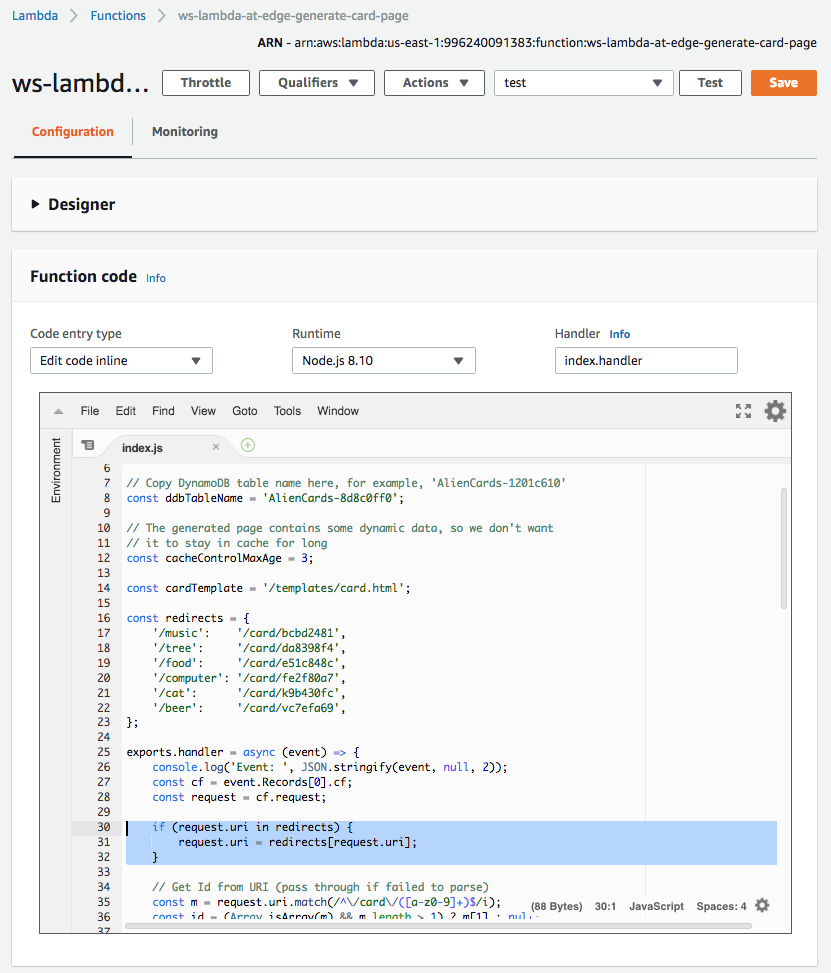
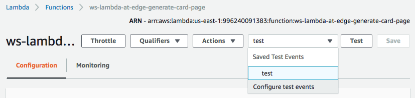
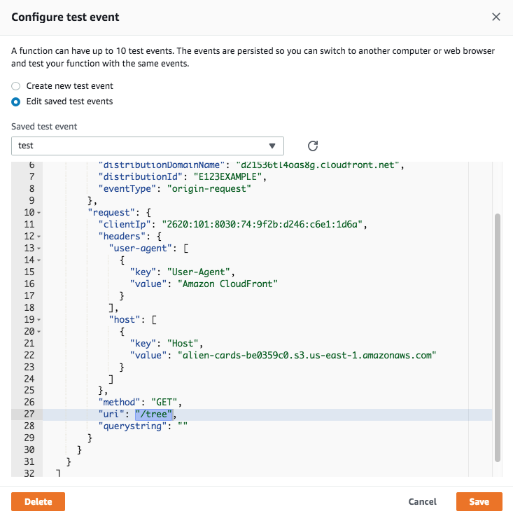
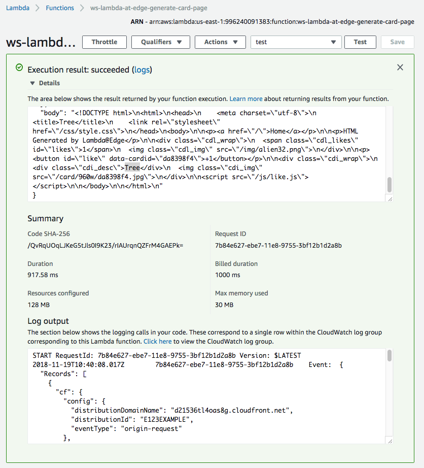
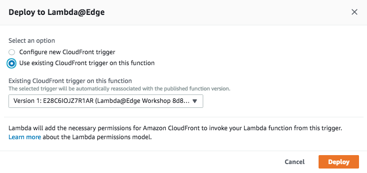
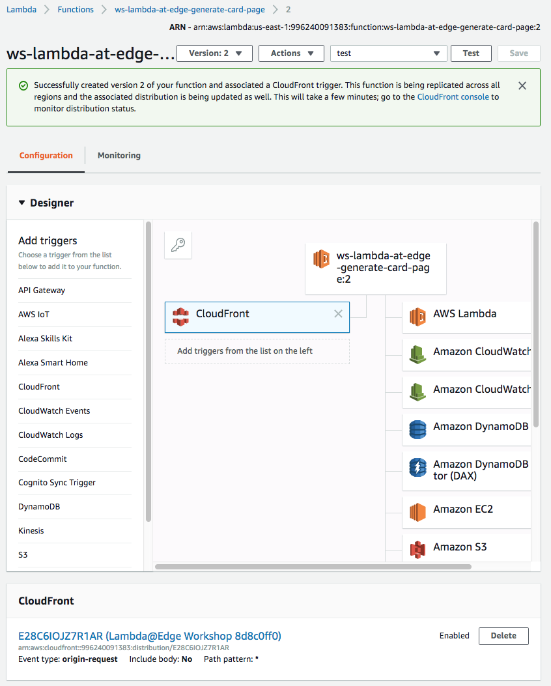
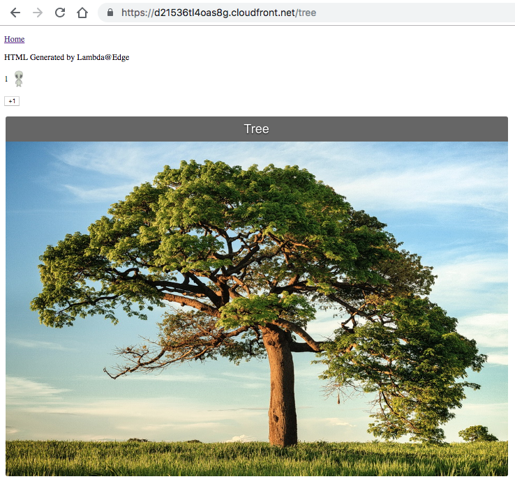

## Lab 6: Rewrite URLs

In this lab, we will use Lambda@Edge to introduce URL rewrites to our web application.


## Steps

[1. URI rewrite](#2-uri-rewrite)  
[1.1 Create/modify the Lambda function](#21-createmodify-the-lambda-function)  
[1.2 Validate the function works in Lambda Console](#22-validate-the-function-works-in-lambda-console)  
[1.3 Deploy to Lambda@Edge](#23-deploy-to-lambdaedge)  
[1.4 URI rewrite now works!](#24-uri-rewrite-now-works)  

### 1. URI rewrite

Let's rewrite the URLs
https://us.123rf.com/450wm/lenanet/lenanet1708/lenanet170800008/83699536-beautiful-close-up-shot-of-lavender-flowers-at-the-field.jpg?ver=6
to he actual card URL  
https://us.123rf.com/450wm/lenanet/lenanet1708/lenanet170800008.jpg
internally within Lambda@Edge so that it's not even visible in the viewer web browser.

#### 1.1 Create/modify the Lambda function


Paste also the following snippet to the beginning of the handler as shown on the screenshot below. This is the actual URI rewrite that changes URI according to the map above. See the screenshot below with the updated function code.

```
if (request.uri in redirects) {
    request.uri = redirects[request.uri];
}
```

<details><summary>Show/hide the screenshot</summary>
  
<kbd></kbd>
</details><br/>

Click `Save`.

#### 1.2 Validate the function works in Lambda Console

Update the test event - click `Configure test events` inside the dropdown list of test events next to the `Test` button.

<details><summary>Show/hide the screenshot</summary>
  
<kbd></kbd>
</details><br/>

Change the `uri` field value to `"/tree"`. Click `Save`.

<details><summary>Show/hide the screenshot</summary>
  
<kbd></kbd>
</details><br/>

Click `Test` and validate the function has returned `200` response with a proper HTML for the tree card in the body field.

<details><summary>Show/hide the screenshot</summary>
  
<kbd></kbd>
</details>

#### 1.3 Deploy to Lambda@Edge

Select `Deploy to Lambda@Edge` under `Actions`. Because we are updating a trigger already created in Lab 2, choose `Use existing CloudFront trigger on this function`. Click `Deploy`.

<details><summary>Show/hide the screenshot</summary>
  
<kbd></kbd>
</details><br/>

The trigger has been successfully updated.

<details><summary>Show/hide the screenshot</summary>
  
<kbd></kbd>
</details><br/>

Wait for ~30-60 seconds for the change to propagate and for the Lambda@Edge function to get globally replicated.

#### 1.4 URI rewrite now works!

Now both URLs show exactly the same content.

* https://d123.cloudfront.net/tree
* https://d123.cloudfront.net/card/da8398f4  

<kbd></kbd>
