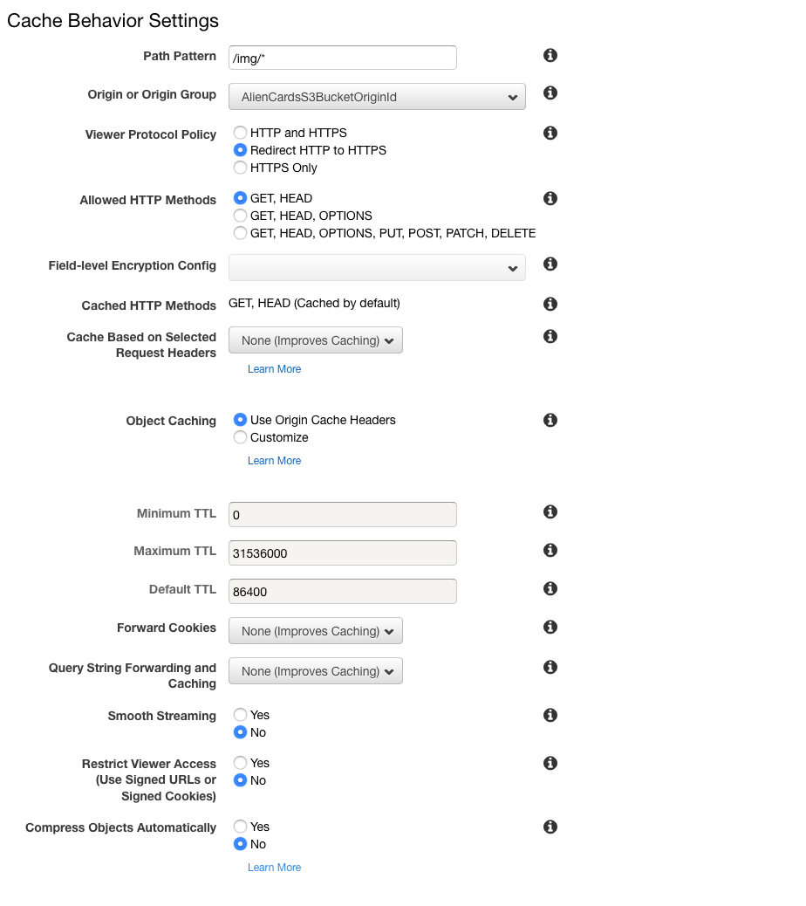
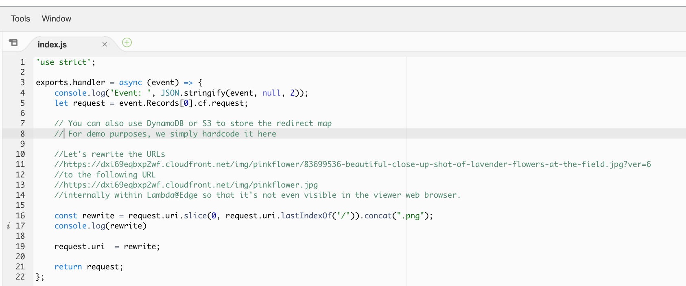

## Lab 6: Rewrite URLs

In this lab, we will use Lambda@Edge to introduce URL rewrites to our web application.

## Steps

[1. URI rewrite](#1-uri-rewrite)  
[1.0 Configure Cloudfront behaviour](#10-cloudfront-behaviour)  
[1.1 Create/modify the Lambda function](#11-createmodify-the-lambda-function)  
[1.2 Validate the function works in Lambda Console](#12-validate-the-function-works-in-lambda-console)  
[1.3 Deploy to Lambda@Edge](#13-deploy-to-lambdaedge)  
[1.4 URI rewrite now works!](#14-uri-rewrite-now-works)  

### 1. URI rewrite

Let's rewrite the URLs
https://example.cloudfront.net/img/alien32/83699536-beautiful-close-up-shot-of-lavender-flowers-at-the-field.jpg?ver=6 .

to the following URL  

https://example.cloudfront.net/img/alien32.jpg

internally within Lambda@Edge so that it's not even visible in the viewer web browser.

#### 1.0 Configure Cloudfront Behaviour

Go to Cloudfront Web Console. https://console.aws.amazon.com/cloudfront/home?region=us-east-1 .
Select the lambda@edge Cloudfront Distribution .
Select "Behaviors" Tab. 
Click "Create Behaviour".

Configure:
* Path Pattern: /img/*
* Viewer Protocol Policy: Redirect HTTP to HTTPS

Show/hide the screenshot

<kbd></kbd>

 

Click `Create`.

#### 1.1 Create/modify the Lambda function

Go to https://console.aws.amazon.com/lambda/home?region=us-east-1#/functions .

Create Function.

Author From Scratch
* Function Name: ws-lambda-at-edge-rewrite
* Runtime: nodejs 8.10
* Execution Role: Use an existing role - "ws-lambda-at-edge-basic"

Use JavaScript code from [ws-lambda-at-edge-rewrite.js](./ws-lambda-at-edge-rewrite.js) as a blueprint. Take a moment to familiarize yourself with the function code and what it does.

Show/hide the screenshot

  
<kbd></kbd>

 

Click `Save`.

#### 1.2 Validate the function works in Lambda Console

click `Configure test events` inside the dropdown list of test events next to the `Test` button.

Use JavaScript code from [ws-lambda-at-edge-rewrite-test-event.json](./ws-lambda-at-edge-rewrite-test-event.json) as the event. Create a test event named "rewriteURLRegex"

Show/hide the screenshot

  
<kbd></kbd>

 

Click `Test` and validate the function has returned `200` response with a proper HTML for the tree card in the body field.

The test input is: "/img/alien32/83699536-beautiful-close-up-shot-of-lavender-flowers-at-the-field.jpg?ver=6"
The expected output is a URLRewrite: "/img/alien32.png"

#### 1.3 Deploy to Lambda@Edge

Select `Deploy to Lambda@Edge` under `Actions`. 

Configure CloudFront trigger properties as shown below, acknowledge replication and click `Deploy`.

Field | Value
--- | ---
Distribution | Select the distribution created for this workshop
Cache behavior | `/img/*` (the default cache behavior matching all URI paths)
CloudFront event | `Origin request`

 

The trigger has been successfully updated.

Show/hide the screenshot

  
<kbd></kbd>

 

Wait for ~30-60 seconds for the change to propagate and for the Lambda@Edge function to get globally replicated.

#### 1.4 URI rewrite now works!

Now any URL with the alien32 path, will have the last bit removed,  showing exactly the same content.

* https://example.cloudfront.net/img/alien32/83688836-close-up-shot-of-lavender-flowers-at-the-field.jpg?ver=5
* https://example.cloudfront.net/img/alien32/83699536-beautiful-close-up-shot-of-lavender-flowers-at-the-field.jpg?ver=6

<kbd></kbd>

Try the following - a variation of alien:

* https://example.cloudfront.net/img/alien32w/83688836-close-up-shot-of-lavender-flowers-at-the-field.jpg?ver=5
